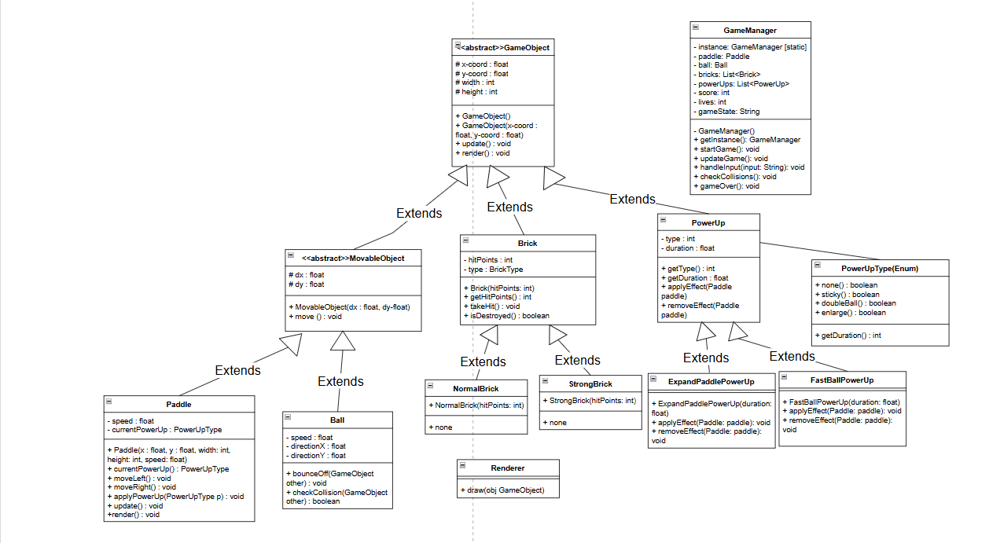

# **OOP-Project**
#***Arkanoid Game (Java Swing)***

Project: Arkanoid — trò chơi phá gạch viết bằng Java + Swing.
## Thành Viên Nhóm           
- Nguyễn Quang Hưng — Nhóm trưởng          
- Cao Thế Mạnh               
- Phạm Xuấn Hiếu              
- Nguyễn Tuấn Thảo            
## Giới Thiệu
Arkanoid là một tựa game cổ điển, người chơi điều khiển một thanh paddle để bật bóng phá vỡ các ô (block).Mục Tiêu là phá hết các block trong mỗi màn chơi mà không để bóng rơi ra khỏi đáy màn hình 
## Cách Chơi
• Sử dụng phím trái/phải để di chuyển thanh paddle
• Nhấn **Phím Cách** để thả bóng và bắt đầu trò chơi
• Di chuyển paddle để giữ bóng không rơi xuống đáy màn hình
• Phá vỡ toàn bộ các khổi để tăng điểm và hoàn thành màn chơi 
• Thu thập **Power-Ups** rơi xuống để nhận các hiệu ứng hỗ trợ 
   • Tăng kích thước paddle
   • Tăng số lượng bóng 
• Mất mạng khi để bóng rơi ra khỏi màn hình
• Trò chơi kết thúc khí hết mạng hoặc thắng khi phá hết block
## Tính Năng Nổi Bật 
• Các màn chơi tăng dần độ khó 
• Hệ thống điểm & lưu điểm cao 
• Hệ Thông các loại gạch với các tính năng khác nhau
     ## 🧱 Các Loại Gạch
| Loại Gạch | Hình Minh Họa | Tính Năng |
|---|---|---|
| Normal Brick |  | Vỡ ngay khi bóng chạm |
| Strong Brick |  | Cần nhiều lần va chạm để phá |
| Unbreakable Brick |  | Không thể phá huỷ |
| Explosive Brick |  | Nổ và phá gạch xung quanh khi bị đánh trúng |
• Hệ thống menu đầy đủ 
  • Menu chính
  • Menu game over
  • Bảng điểm
  • Pause/Resume Game
• Giao diện đồ họa trực quan 
  • Paddle, bóng, gạch, background
  • Hiển thị mạng sóng bằng icon trái tim
  • Hiển thị điểm
• Hiệu ứng âm thanh 
  • âm thanh va chạm
  • âm thanh phá gạch
  • Nhạc nền
## UML Diagram

