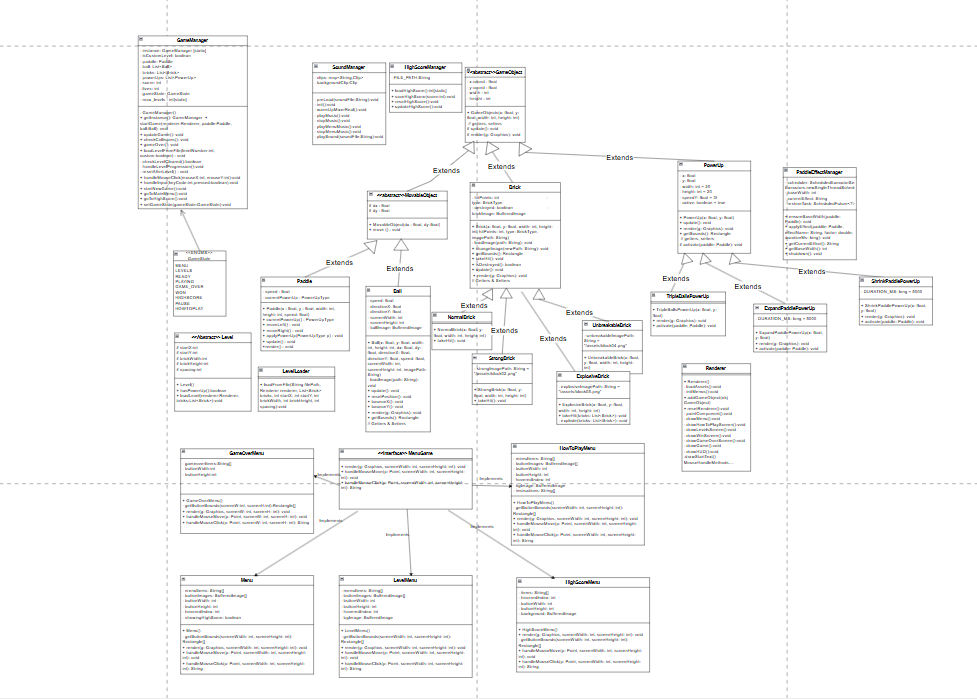

# **OOP-Project**
## ***Arkanoid Game (Java Swing)***
##  UML Diagram

[UML Diagram Source (.drawio)](assets/dr.drawio)
## Link Demo Game : https://drive.google.com/file/d/100f51yzKPBwbELDzSKNLmItAsRuxCIhR/view?usp=sharing
Project: Arkanoid — trò chơi phá gạch viết bằng **Java + Swing**.

## Thành Viên Nhóm
- Nguyễn Quang Hưng — Nhóm trưởng  : Làm sơ đồ lớp và paddle , ball và powerup cho ball
- Cao Thế Mạnh  : làm giao diện game , âm thanh , powerup cho paddle
- Phạm Xuân Hiếu  : làm hệ thống gạch và các map chơi của game
- Nguyễn Tuấn Thảo  : làm logic game + làm 1 phần giao diện game

## Giới Thiệu
Arkanoid là một tựa game cổ điển, người chơi điều khiển thanh **paddle** để bật bóng và phá vỡ các ô gạch (block).  
Mục tiêu: **Phá hết gạch trong mỗi màn chơi và không để bóng rơi xuống đáy**.

## Cách Chơi
- Sử dụng **Phím Trái/Phải** để di chuyển paddle  
- Nhấn **Space** để thả bóng bắt đầu game  
- Di chuyển paddle để giữ bóng  
- Phá vỡ toàn bộ các khối để qua màn  
- Thu thập **Power-Ups** để nhận hiệu ứng hỗ trợ:  
  - Tăng kích thước paddle  
  - Tăng số lượng bóng  
- Mất mạng khi bóng rơi khỏi màn hình  
- Game Over khi hết mạng hoặc thắng khi phá hết gạch  

##  Tính Năng Nổi Bật
- Các màn chơi tăng dần độ khó  
- Hệ thống điểm & lưu điểm cao  
- Nhiều loại gạch với tính năng khác nhau  

### Các Loại Gạch

| Loại Gạch | Minh Họa | Tính Năng |
|---|---|---|
| Normal Brick |  | Vỡ ngay khi bóng chạm |
| Strong Brick |  | Cần nhiều lần va chạm để phá |
| Unbreakable Brick |  | Không thể phá huỷ |
| Explosive Brick |  | Nổ và phá gạch xung quanh |

### Hệ Thống Menu
- Menu chính  
- Menu Game Over  
- Bảng điểm  
- **Pause / Resume**  

### Đồ Hoạ & Hiển Thị
- Paddle, bóng, gạch, background  
- Hiển thị mạng bằng icon trái tim 
- Hiển thị điểm trực tiếp  

### Âm Thanh
- Âm thanh va chạm  
- Âm thanh phá gạch  
- Nhạc nền  
